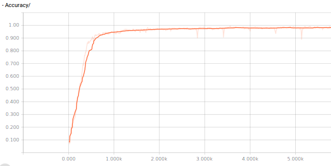

# Character-Level Convolutional Neural Network in TFLearn

## Introduction
Based on the character level convolutional neural network (X. Zhang et al. 2015)
Preproccessing based on https://github.com/NVIDIA/DIGITS/blob/master/examples/text-classification/create_dataset.py

## Dataset
In this example it will be used the [DBPedia](http://wiki.dbpedia.org) ontology dataset.
The load_csv module in TFLearn utilize categories from 0 to n_classes-1. The preprocessesed dataset will be available in my [Google Drive storage](https://goo.gl/aLV7Nv).

Download the file 'DBPedia.tar.gz' and extract its content in a folder that we will refer to it as $DBPedia

### Requisites
the bleeding edge version of TFLearn (0.2.2)

tensorflow-gpu (0.12.0rc0)

Numpy

### The model
The model uses a preprocess to convert each note into a numpy array of numbers representing each character from a 71 character alphabet using lowercase letters, punctuation simbols and others


### Runing the model

```sh
$ cd /$DBPedia
$ python CNN.py
```
### Results
Training Accuracy


Validation Accuracy


In the validation set we got up to 96% accuracy


### Testing
Use the bestcheckpoint file to test the model with this command
before runing it, select the checkpoint you want to use and write it down in train.py
```sh
$ cd $DBPedia
$ python train.py
```
